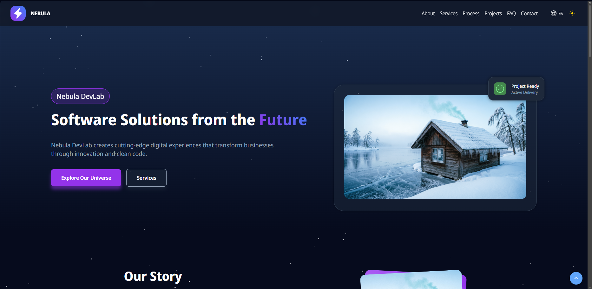
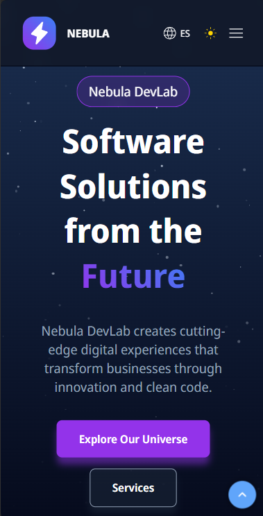
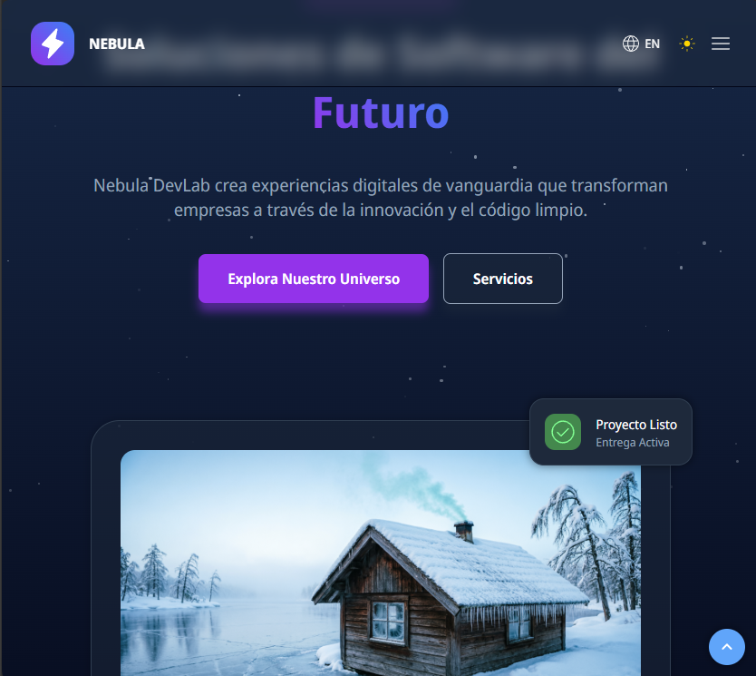
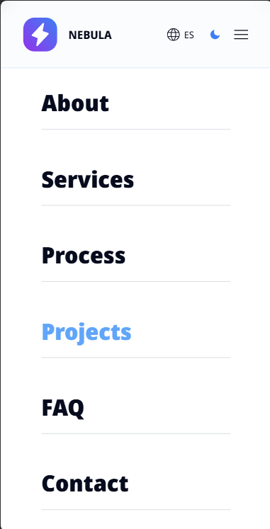
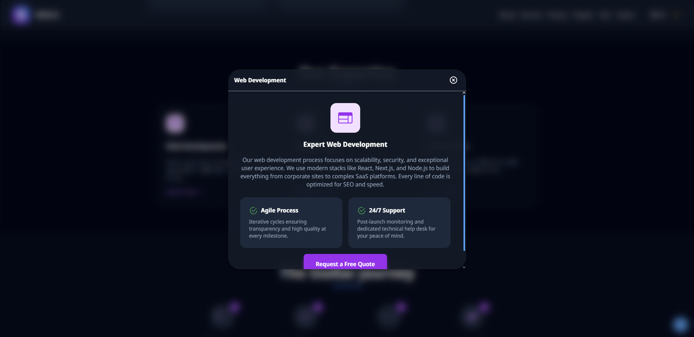
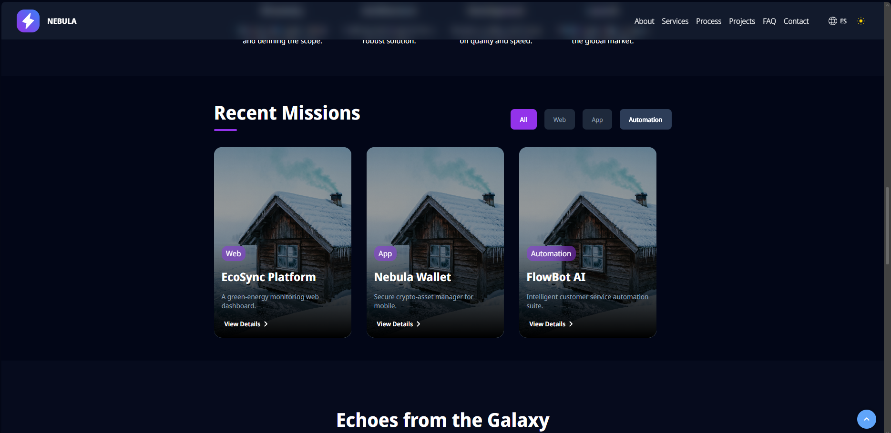

# Nebula DevLab – Portfolio Landing Page

## English

Nebula DevLab is a modern, visually engaging landing page project designed as a portfolio practice. This site is **not a real business**, but a demonstration of web development skills and UI/UX design for personal growth and presentation.

### What is a Landing Page?

A landing page is a single web page created to showcase a product, service, or brand, often used for marketing or portfolio purposes. It focuses on clear information, strong visuals, and user interaction.

### Technologies Used

* **HTML5** – Semantic structure and accessibility
* **CSS3** – Modular, responsive, and mobile-first styles
* **JavaScript (ES6+)** – DOM manipulation, modular scripts
* **JSON** – Dynamic content for services, projects, and localization

### Methodologies & Models

* **CSS and JS modularization**: Each section/component has its own file for maintainability
* **DOM manipulation**: Content and modals are dynamically injected via JavaScript
* **Responsive design**: Mobile-first approach with media queries
* **Separation of concerns**: Data (JSON), logic (JS), and presentation (CSS) are clearly separated

### Features

* Anchor-based navigation with smooth scrolling
* Back-to-top button for easy navigation
* Hover transitions and interactive animations
* Animated backgrounds (e.g., stars), custom loader animation
* Language switcher (English/Spanish) using JSON and JS
* Theme switcher (light/dark mode)
* Dynamic content for services, projects, and testimonials
* Modal popups for detailed information
* Accessible and semantic HTML structure

### Note

This project is for **portfolio and learning purposes only**. All content, branding, and data are fictional. The image was generated using Artificial Intelligence.

---

## Español

Nebula DevLab es una landing page moderna y visualmente atractiva, creada como práctica de portafolio. Este sitio **no es un negocio real**, sino una demostración de habilidades en desarrollo web y diseño UI/UX para crecimiento y presentación personal.

### ¿Qué es una Landing Page?

Una landing page es una página web única creada para mostrar un producto, servicio o marca, utilizada comúnmente en marketing o portafolios. Se enfoca en información clara, visuales impactantes e interacción con el usuario.

### Tecnologías Usadas

* **HTML5** – Estructura semántica y accesibilidad
* **CSS3** – Estilos modulares, responsivos y mobile-first
* **JavaScript (ES6+)** – Manipulación del DOM, scripts modulares
* **JSON** – Contenido dinámico para servicios, proyectos y localización

### Metodologías y Modelos

* **Modularización de CSS y JS**: Cada sección/componente tiene su propio archivo para facilitar el mantenimiento
* **Manipulación del DOM**: El contenido y los modales se inyectan dinámicamente con JavaScript
* **Diseño responsive**: Enfoque mobile-first con media queries
* **Separación de responsabilidades**: Datos (JSON), lógica (JS) y presentación (CSS) claramente separados

### Funcionalidades

* Navegación por anclas con desplazamiento suave
* Botón para volver al inicio de la ventana
* Transiciones y animaciones interactivas al hacer hover
* Fondos creados con CSS (estrellas), animación de loader personalizada
* Cambio de idioma (inglés/español) usando JSON y JS
* Cambio de tema (modo claro/oscuro)
* Contenido dinámico para servicios, proyectos y testimonios
* Modales emergentes para información detallada
* Estructura HTML accesible y semántica

### Nota

Este proyecto es solo para **fines de portafolio y aprendizaje**. Todo el contenido, marca y datos son ficticios. La imagen fue generada mediante Inteligencia Artificial.

## Screenshots

